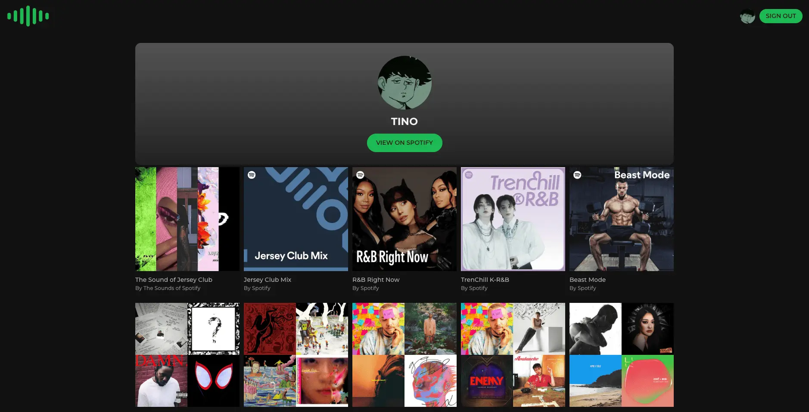

A project using the Spotify API to generate a topster from personal playlists, visualizing favorite albums or songs in a grid format.

### URL:

<https://tinodevclumsy.github.io/statify/>

### Pages

|  |  |
| :-----------------------------: | :------------------------------: |
|          Landing Page           |          Playlist Page           |

|  |
| :--------------------------------------------: |
|                   Board Page                   |

### Downloaded Result

### STACKS:

- React
- Context API
- styled-components
- Spotify API

### More:

If you have any further inquiries or feedback regarding the website, feel free to reach out at any time.
