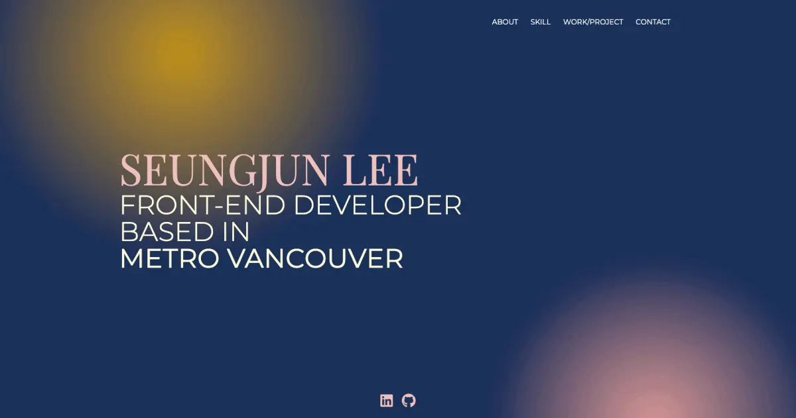

The website is created with the purpose of presenting and introducing myself better, showcasing introduction, skills, work, projects and contact information.

### URL:

<https://tinodevclumsy.github.io/portfolio/>

### STACKS:

- React
- Gatsby
- styled-components
- Tailwind CSS

### More:

If you have any further inquiries or feedback regarding the website, feel free to reach out at any time.
