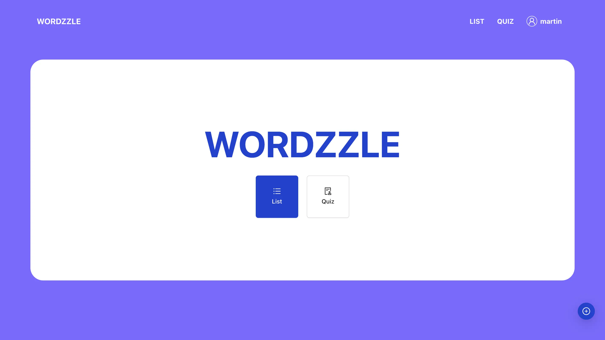

The project featured an intuitive frontend with CRUD operations, a backend for data management, secure user authentication using JWT, and interactive quizzes as key features

### URL:

<https://genuine-biscuit-785b86.netlify.app/>

### STACKS:

  - React
  - Redux
  - Express.js
  - MongoDB
  - styled-components

### More:

If you have any further inquiries or feedback regarding the website, feel free to reach out at any time.
